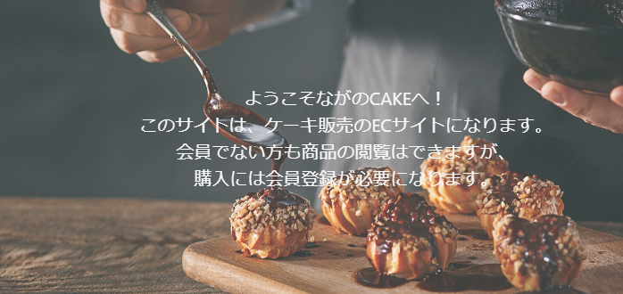

# チーム　ピノキオ制作
## ながのCAKE ECサイト

### 概要
長野県にある小さな洋菓子店「ながのCAKE」の商品を通販するためのECサイト開発。
## ※実在しないためご注意ください。 ##

### 案件の背景
元々近隣住民が顧客だったが、昨年始めたInstagramから人気となり、全国から注文が来るようになった。
InstagramのDMやメールで通販の注文を受けていたが、情報管理が煩雑になってきたため、管理機能を含んだ通販サイトを開設しようと思い至った。

### 使用したGen

  <button class="copy-button" onclick="copyToClipboard()"></button>
  <pre><code id="code-block">
gem 'devise'
gem 'kaminari'
gem "enum_help"
gem 'image_processing', '~> 1.2'
gem 'font-awesome-rails'
  </code></pre>

